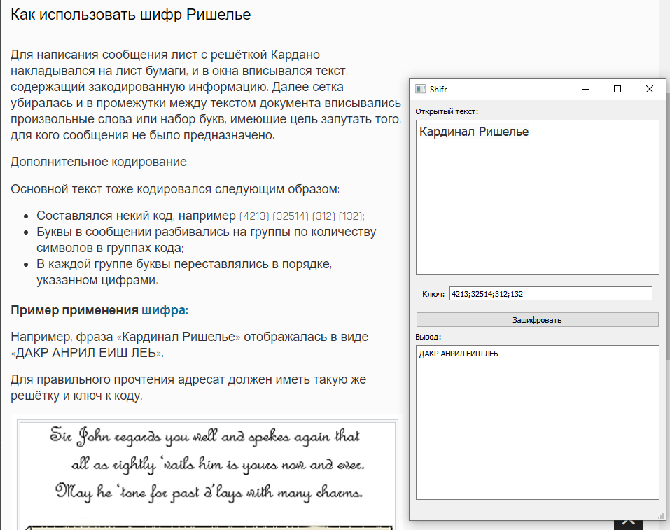

# App The Richelieu Cipher
 C++ Qt5
## Шифр Ришелье
Метод кодирования шифром Ришелье заключается в следующем: пусть имеется сообщение, записанное с помощью букв латинского алфавита, и набор перестановок различной длины, тогда к сообщению применяют эти перестановки, разбивая сообщение на части и переставляя в них буквы определённым образом, в результате получают зашифрованное сообщение.

Напишите программу, которая на вход получает сообщение и набор перестановок, и результатом её работы является зашифрованное методом Ришелье сообщение.

Замечание:

1) При шифровании сообщения в нём игнорируются пробелы и знаки препинания, а также все буквы переводятся в прописные.

2) Перестановка длины n — это набор чисел от 1 до n, записанный в определённом порядке. Элементы перестановки вводятся через пробел, а сами перестановки разделены «;».

3) Суммарная длина перестановок совпадает с количеством букв в сообщении и не превышает 250.

Пример: Сообщение «I am happy!» и 2 перестановки «2 3 1; 4 2 1 3 5», тогда сообщение преобразуем к виду «IAMHAPPY», применяя первую перестановку к первым трём буквам, получим «AMI», вторую перестановку к следующим пяти буквам—»PAHPY». В итоге получим «AMIPAHPY».

